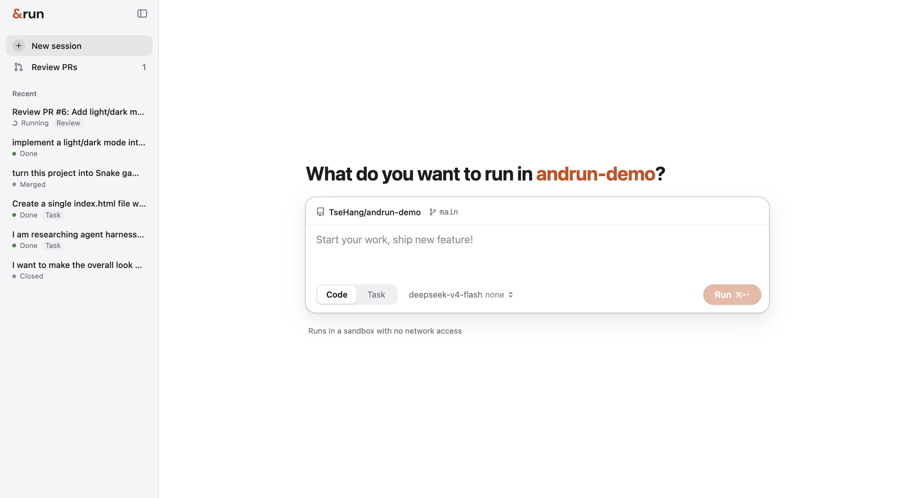
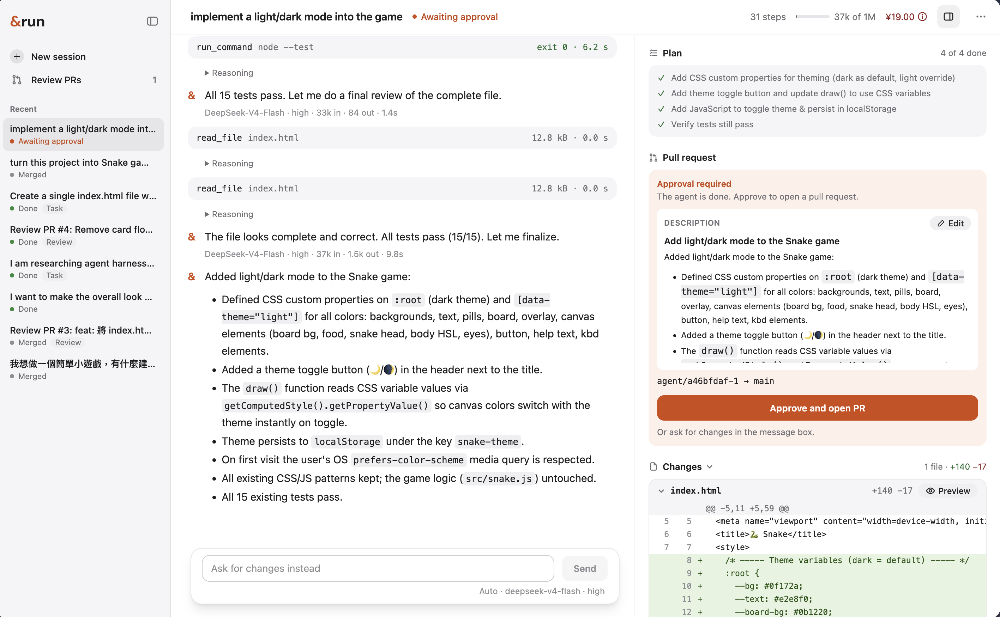
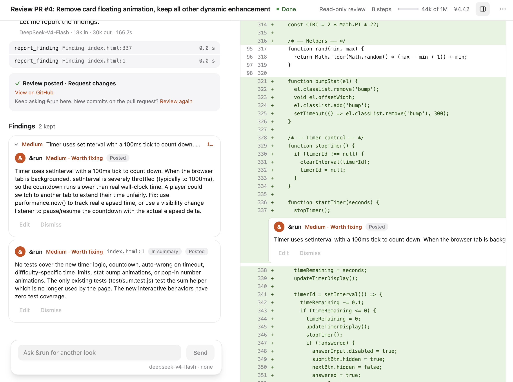
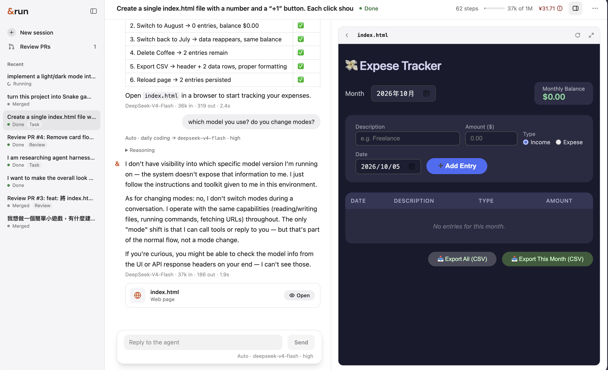

  

A coding agent workspace powered by **ai& Inference**. Code, review pull requests, or create something from scratch—all in a conversation.

## Three ways to work

| Mode | What it does |
|---|---|
| **Code** | Reads your selected GitHub repository, plans changes, edits files and runs commands or tests. |
| **Review** | Reviews a pull request's changes and suggests findings for you to check and post. |
| **Task** | Works without a repository to automatically complete long-running tasks, create HTML pages, Markdown documents and CSV files. (Goal: Manus-like feature) |

## Features

- **Keep your work in one session.** Discuss a change, code it, open a PR and bring review feedback back to the agent. Continue from the same conversation while the PR is open.
- **Review with &run's suggestions.** Inspect findings alongside the diff, edit or dismiss them, and choose your own comment and verdict.
- **Auto mode with ai& models.** Spend more computation where the task needs it, instead of using the bigger model for every small task. You can also choose the model and reasoning effort yourself.
- **See the work as it happens.** Follow the plan, commands, changes and estimated model cost. Redirect or stop the agent when needed.
- **Approve before publishing.** Check the diff and edit the PR title and description before opening or updating it on GitHub.
- **Preview and download Task results.** Open interactive HTML in the workspace, or download HTML, Markdown and CSV files.
- **Disposable execution.** Each session runs in an isolated sandbox. Conversations and saved text changes persist; processes and installed dependencies do not survive a rebuild.

## Current limits

- **No user accounts.** This is a shared demo with two GitHub roles: the App bot writes code, and the configured reviewer account posts reviews. Visitors share sessions and these identities.
- **One target repository.** Code and Review currently use [andrun-demo](https://github.com/TseHang/andrun-demo). Connecting a GitHub account and selecting its authorized repositories is future work.
- **Basic Auto routing.** &run currently classifies tasks and selects from two fixed routes. Cost optimization has not been validated. Routing that considers ai& serving and prompt-cache costs is a product hypothesis, not an implemented feature.
- **Restricted network.** Code and Review are offline. Task can fetch URLs using HTTP/HTTPS GET and HEAD, but has no search tool yet.
- **Real inference, demo access.** The demo calls the real ai& Inference API with a limited model selection. There is no ai& account connection; usage is paid through my API key.

See [known limits](docs/limits.md) for the technical details.

- Project: [TseHang/andrun](https://github.com/TseHang/andrun).
- Target coding project: [TseHang/andrun-demo](https://github.com/TseHang/andrun-demo).

## In action

### Code — inspect changes and open a PR

### Review — findings alongside the diff

### Task — create and preview a page

## Docs & progress

- [Docs & progress](docs/README.md) — design decisions and implementation history.
- [Known limits](docs/limits.md) — current technical boundaries.
- [To-dos](docs/todos.md) — what's next.
- [Development & deployment](docs/development.md) — setup and verification.
