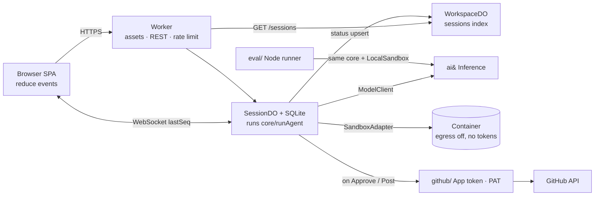

# &run — Architecture Decision

**Status**: ✅ Agreed (2026-09-30); amended 2026-10-02 to match the v2 design (see "Amendments")
**Date**: 2026-09-30
**Codex**: used (one round, see last section)
**Inputs**: `aiand-codex-spec.md` v1.2 FINAL, `aiand-codex-task.md`
**Diagram**: [`web-codex-flow.html`](./web-codex-flow.html) (system flow + session state machine)

## Problem

**&run** is a Codex-style coding workspace. Build it on Cloudflare using ai& Inference (OpenAI-compatible). It has three modes on one agent loop:
- **Code**: edit the connected repo, then open a PR on approval.
- **Review**: draft findings on a PR; the human posts the review.
- **Task**: chat, or work in a sandbox that produces artifacts.

Constraints:
- **3 days**, one engineer, deployed from Phase 2 onward. Day plan: Day 1 = Phases 1–2, Day 2 = Phase 3, Day 3 = Phase 4 + README/video. Phase 5 and every bonus are cut unless Phase 4 is done.
- No login.
- Secrets stay server-side, and no token ever enters the sandbox.
- A run lasts minutes and can pause indefinitely for approval.
- The session survives a page refresh.
- The same loop must run offline in an eval harness (5 cases × 3 runs).

Success means:
- Acceptance tests A–E pass on the public URL.
- Eval shows every case ≥ 2/3 with no test-editing.
- A reviewer can read `src/core/` in 5 minutes and understand the agent.

## Verified facts (2026-09-30)

These were checked before any decision was made.

| Question | Finding | Source |
|---|---|---|
| Sandbox SDK stable? | **`@cloudflare/sandbox@1.0.0` was published 2026-09-30 01:44Z (GA).** The API is a rewrite: there is no `getSandbox`, `Sandbox` class, `gitCheckout`, `sleepAfter` or `keepAlive`. You write your own DO; `this.ctx.container.start({image, enableInternet})` and `container.exec(argv, {cwd, env, signal, stdout:"pipe"})` return `stdout`/`stderr` as `ReadableStream` plus `exitCode`. The package adds `Files` (`readFile`→`Response`, `writeFile`, `stat`, `readDirectory`, `mkdir`, `remove`, `rename`), `DirectoryBackup` (R2) and `S3Mount`. The image must contain `/usr/local/bin/sandbox-shim`. 0.x gets maintenance until 2026-12-31. | npm tarball `dist/index.d.mts` + README (checked locally); developers.cloudflare.com/sandbox/reference |
| Exec timeout / network | There is no default exec timeout, so we pass an `AbortSignal`. Egress is off with `enableInternet:false`. Hosts can be allow-listed through outbound handlers that run in the Worker, which is also where credential injection happens. | /sandbox/concepts/security, /containers/platform-details/durable-object-methods |
| Wrangler config | `containers:[{class_name, scheduling_policy:"durable_object"}]` plus a DO binding with SQLite storage; needs `nodejs_compat` and wrangler ≥ 4.141. `scheduling_policy: durable_object` is **public beta and cannot be rolled back** per class. | /sandbox get-started |
| Local dev needs Docker? | **Yes.** `wrangler dev` / `vite dev` with containers needs Docker Desktop or Colima running. | /containers/local-dev |
| Plan | Workers Paid. Instance types range from `lite` (256 MiB) to `standard-4`. | /containers/pricing, /limits |
| GitHub App key | GitHub issues PKCS#1 (`BEGIN RSA PRIVATE KEY`). WebCrypto `importKey('pkcs8')` needs PKCS#8. universal-github-app-jwt converts automatically **only in its Node build**. Convert once: `openssl pkcs8 -topk8 -inform PEM -outform PEM -nocrypt -in app.pem -out app-pkcs8.pem`. Installation tokens live 1 h; the App JWT lives ≤ 10 min. | universal-github-app-jwt 2.2.2 README; GitHub docs |
| DO limits | Wall-clock is unlimited while a request, WebSocket or I/O is in flight. CPU is 30 s per invocation by default (I/O waits don't count). Alarms get 15 min. A DO can be evicted when idle, so in-memory state must be treated as disposable. | /durable-objects/platform/limits, /best-practices/websockets |

Not verified (checked during Phase 1, day 1):
- Whether a DO class can be both the session DO and the container DO. Fallback: two classes, session DO → sandbox DO via RPC.
- Whether `@cloudflare/vite-plugin` runs containers in `vite dev`. Fallback: `wrangler dev` for the Worker, with Vite proxying.
- Exact `Files.readDirectory` entry shape.

## Architecture

**The core is a plain loop behind three ports.** `src/core/` has no Cloudflare imports.

`runAgent(state, profile, deps)` runs until the model finishes or a limit is hit:
1. It calls `deps.model` (`ModelClient`: ai& via plain `fetch` + SSE, tool-call deltas assembled).
2. For each tool call, `deps.policy` (`ApprovalPolicy`) returns `allow | ask | deny`.
3. Allowed calls run through `deps.sandbox` (`SandboxAdapter`: `exec` streamed, `readFile`, `writeFile`, `listFiles`, `diff`).
4. It emits §5 events through `deps.emit` and calls `deps.checkpoint(state)` after every step.

When a call needs approval, **the loop returns** `{kind:"awaiting_approval", pending}` instead of awaiting a promise. The pending state is persisted. Resuming appends the decision as the tool result and calls `runAgent` again with the loaded state.

Because of this, pausing and resuming are the same code path:
- a pause of minutes or days
- the DO being evicted
- the browser refreshing

The core also has no knowledge of GitHub. `finish` approved in Code mode is handled by the DO, which calls `github/` (see D9).

**One Durable Object per session owns everything stateful.** It:
- holds the WebSocket (Hibernation API)
- stores `session`, `messages`, `events(seq)`, `pending_approval` and `changes` in its SQLite
- drives `runAgent`
- owns the sandbox container

**One fixed-name WorkspaceDO indexes the sessions** for the sidebar (D16). There is no user concept, so this index and the per-session SQLite are the only storage.

**Events are the single source of truth for the UI.** Each event is written with a monotonically increasing `seq` in the same transaction as the state change, then broadcast. A reconnecting client sends `lastSeq` and receives the missed events.

Some output is high-frequency and is handled separately:
- **Token deltas** are broadcast only, not persisted; the final `message` event is persisted.
- **stdout** is coalesced into ~250 ms chunks before it is persisted.

**The sandbox never talks to GitHub.**
- The Worker downloads the repo tarball at a pinned SHA (Code) or the PR head SHA (Review). It writes the tarball into the container with `Files` and runs `git init && git commit` as the baseline. `git diff` then works, and container egress stays **fully off**.
- On approval, the DO reads the changed files out of the sandbox. The Worker-side `github/` module creates blobs → tree → commit → branch → PR with an App installation token.
- Reviews are posted with the PAT.
- Tokens exist only on the Worker → api.github.com edge.

**The eval harness is a second host for the same core.** `eval/run.ts` runs the cases:
- Cases come from `eval/cases/*.yaml`.
- `runAgent` runs with `LocalSandbox`, which implements `SandboxAdapter` over a temp dir and `child_process` against local fixture repos.
- It uses the real ai& `ModelClient`, and `emit` writes each event to `eval/runs/<ts>/<case>-<n>.jsonl`.
- It prints a summary table with pass, steps, tokens, cost, tool errors and `edited_tests`.

The loop can also be tested without the network: a `ScriptedModelClient` replays a fixed tool-call script. This tests control flow, not model quality.

## Key Decisions

> Binding for every /spec-with-test and /build-to-run below. Do not re-decide during implementation.

| # | Decision | Choice | Reason | Revisit if |
|---|---|---|---|---|
| D1 | Core boundary | `src/core/` = `runAgent`, `events.ts`, `modes.ts`, `tools.ts`, `model.ts`, `policy.ts`, with **zero** `cloudflare:*` imports (lint rule). Ports: `ModelClient`, `SandboxAdapter`, `ApprovalPolicy`, plus `emit`/`checkpoint` callbacks. | Eval and unit tests run the same loop in Node, and a reviewer can read the agent in one folder. | A port needs a Cloudflare type → wrap it; don't leak it. |
| D2 | Loop shape | A `while` loop over model turns, not a graph or state-machine library. Limits: max 30 steps, token budget N from config, 3 consecutive failures on the same tool → `ask`. Tool errors return to the model as tool results. | The model plans; the code enforces limits. This is the "Why a loop, not a graph" README section. | A mode needs branching that a profile can't express. |
| D3 | Pause/resume | Approval is a **return**, not an awaited promise: `runAgent` returns `awaiting_approval`, the DO persists `pending_approval`, and resuming calls `runAgent` again with the tool result appended. A checkpoint of `messages` + counters is written after every step. | Survives DO eviction and waits of any length without keeping the DO pinned, and there is one code path. | — |
| D4 | Mode profile | `ModeProfile = {systemPrompt, tools[], policy, sandboxSetup: "tarball@sha" \| "pr-head@sha" \| "empty" \| "none", onFinish: "open_pr" \| "draft_review" \| "answer"}`. Code, Review and Task are data, not branches in the loop. Review simply omits `apply_patch`/`write_file`, and the Review policy denies non-allowlisted commands. | Spec D6. Review-can't-write is enforced by the missing tool, not by a prompt. | — |
| D5 | Runtime placement | The loop runs inside the SessionDO, started from the RPC/WS message that triggers it. There is **one DO class that is both session and container host**. Confirmed by the spike (2026-09-30, `spike-sandbox-1.0.md`): SQLite rows and a running container coexist in one DO, and the rows survive a container destroy. | Fewest moving parts, and the container lifecycle is tied to the session. | Phase-1 spike fails → two classes (a pre-agreed fallback, not a re-decision). |
| D6 | Session state machine | `idle → running ⇄ awaiting_approval → done`; any state → `failed`, and `running → budget_exceeded`. A new user message moves `done`/`failed`/`budget_exceeded` → `running` (a new turn, same sandbox if alive). Every transition persists a `status` event. A redirect message while running is queued and injected at the next step boundary. | Matches the §5 `status` values exactly. | — |
| D7 | Event contract | `src/core/events.ts` is a discriminated union of the 13 §5 events. Envelope: `{seq, ts, sessionId, stepId?}`. `message` carries `{id, role, text}`; deltas travel as the non-persisted `message_delta {id, text}`. `tool_output` is coalesced (≤ 250 ms). Web imports the same file. *Amended 2026-10-02 (A2): the final `tool_output` may carry an optional `meta {bytes?, files?}`.* | One contract, compile-checked on both sides. | — |
| D8 | Persistence | DO SQLite only. Tables: `session`, `messages` (model transcript), `events` (seq PK), `pending_approval`, `changes` (path, before-sha, after content hash). There is no external DB, no KV and no R2 in M1–M3. | Spec D5. Refresh is served by an event replay. | Task artifacts (M4) → R2. |
| D9 | GitHub identities | **App bot** opens PRs via the Git Data API (blobs → tree(base_tree) → commit → `refs/heads/agent/<session>-<round>` → PR). The ref name is deterministic, so a retry reuses it (idempotent). **Henry's fine-grained PAT**, scoped to one repo, posts reviews with `commit_id` = head SHA and `comments[{path,line,side:"RIGHT"}]`. Findings that are not on a diff line go into the review body. The App key is stored as **PKCS#8** and the JWT is signed with WebCrypto RS256. The installation token is cached in memory for ~50 min. | Spec D2 and §7. It avoids the "author can't request changes on own PR" rule. | — |
| D10 | Sandbox I/O | Repo in: the Worker fetches the tarball at a SHA and streams it in through `Files`; the container runs `git init` as the baseline. Egress: **off** (`enableInternet:false`). Demo repos have zero dependencies (`node:test`). Exec: argv via `sh -lc`, with an `AbortSignal` timeout of 120 s per command. Container idle timeout: 15 min, plus `destroy()` on `done`/`failed`. | Zero token or network surface in the sandbox. There is no default timeout in 1.0. | A case needs `npm install` → allow-list `registry.npmjs.org` through an outbound handler. |
| D11 | Sandbox loss | If the container is gone at resume time, rebuild: tarball@SHA + replay `changes` from SQLite, emit `error{source:"sandbox"}` + a note, then continue. A command that was in flight is reported as failed, not retried. | Codex point: side effects are at-least-once. Files are restorable; processes are not. | — |
| D12 | Eval harness | `eval/cases/*.yaml`: `{id, fixture, mode, task, check: {cmd, expect_exit}, forbid_changes: ["test/**"], max_steps}`. `LocalSandbox` works on a tmp dir with `child_process` and **no isolation** (trusted fixtures only). JSONL = the §5 events + a final `{type:"result", pass, steps, tokens_in, tokens_out, cost, tool_errors, edited_tests}`. Command: `pnpm eval --model <id> --runs 3`. | Same core, real model; the model choice is made by data (spec §10). | — |
| D13 | Frontend | **Vite + React 19 + TypeScript + Tailwind v4**, SPA on Workers static assets. The UI state is `useReducer(events)`. Diff rendering uses a library decided in Phase 3; no Monaco. The client has no secrets. *Decided 2026-10-02 (A3): our own unified-diff component, no library.* | Spec D5. No SSR need, and Vite has a first-party Cloudflare plugin. | — |
| D14 | Abuse limits | Per-IP rate limit (Workers Rate Limiting binding) on session create, GitHub writes and delete session; the per-session budget comes from D2. A global kill-switch env var disables GitHub writes. | No login (spec D3). | See open question Q1. |
| D15 | Sandbox SDK version | **1.0.0** (own DO + `ctx.container` + `Files`), pinned to an exact version. Do not use 0.x. The spike went ✅ Go (2026-09-30); Phase 2 findings are in `spike-sandbox-1.0.md`. | The spec requires the stable release; 0.x is legacy, with maintenance until 2026-12-31. | 1.0 blocks progress for > half a day → pin `0.12.x` (known API) and note it in the README. |
| D16 | Session index | One fixed-name **WorkspaceDO** (`env.WORKSPACE.getByName("workspace")`). Its SQLite holds `sessions(id, mode, title, status, created_at, updated_at)`. SessionDO upserts its row on create and on every `status` transition, after its own transaction commits. The sidebar reads the list with `GET /sessions` → WorkspaceDO. The index is a cache: SessionDO stays the source of truth, a failed upsert is logged and retried on the next transition, and opening a session always reads SessionDO. There are no users, accounts or auth tables (spec D3: one shared workspace), and the PR list is not stored (read live from GitHub). | Each SessionDO has its own SQLite, so nothing can list all sessions without a global index. The same DO-SQLite pattern needs no D1 or KV. | The session list needs search or pagination beyond ~1k rows → D1. |
| D17 | Context management | The core keeps the prompt within the model window without an extra LLM call. (1) Each tool result is capped at 8 KB (head + tail, with `[… N bytes elided]` in the middle). (2) Before each model call, if the estimated prompt is > 70 % of `contextWindow` (per model, in config), the oldest tool results are replaced with a one-line stub (`[read src/sum.js — elided]`), keeping the system prompt, user messages, and the last 6 steps intact. (3) Each `usage` event carries `context_tokens` and `context_window`, and the header shows a context meter. LLM-summary compaction is out of scope. | With 30 steps per session, mechanical compaction is enough and deterministic, so the eval can test it. | The eval shows failures from lost context → add summary compaction. |
| D18 | Delete session | Sidebar row → Delete (with confirm) → `DELETE /sessions/:id`. SessionDO then: aborts the loop, `container.destroy()`, closes the WebSockets, and calls `ctx.storage.deleteAll()`, which also clears the alarm (compat date ≥ 2026-02-24). The Worker then removes the WorkspaceDO row. A DO can't be "revoked"; its name still resolves. An emptied DO stores nothing and costs nothing, so every SessionDO method checks for its `session` row and returns 404 when it is missing, instead of recreating an empty session. | Gives the user an explicit "free the resources now" action and a clean list. | — |
| D19 | Model selection (heterogeneous mode, **bonus, illustrative only**) | The model is chosen behind the `ModelClient` port. MVP: one model per mode from config (e.g. `code`/`review` → the coding model, auto-approve classifier → a small cheap model). *Amended 2026-10-02 (A1): the user picks one of four models per session; the config value is the default.* Every `usage` event records `model`. **Heterogeneous mode** would be a `RouterModelClient` that picks a model per step (plan vs. edit vs. read vs. classify) and may shape the call. It needs ai&'s internal routing API, so it is **not implemented**: the composer shows a disabled "Auto (heterogeneous)" model option with a short explanation, and the README's "What's next" section describes the design. | ai& controls the stack from server to model, so per-step routing is where it can optimise. Because the port already exists, adding it later changes no core code. | ai& exposes a routing API → implement `RouterModelClient` and evaluate it with the same harness. |

## Alternatives Rejected

| Alternative | Why it lost |
|---|---|
| Awaiting a promise in the DO for approval (my first Position A) | It pins the DO in memory and is lost on eviction. D3 gets the same behaviour with one code path. |
| Effect/intent state machine driven by alarms (Codex B) | It is correct but heavy for 3 days, and alarms cap at 15 min per run. D3 + D11 cover the same failure modes with a checkpoint per step. |
| R2 workspace snapshot before approval (Codex B) | `changes` in SQLite + tarball@SHA rebuilds the workspace without another binding. `DirectoryBackup` stays an option if repos grow. |
| `git clone` inside the sandbox with an outbound allow-list | It adds network surface, and a private repo would need a token near the sandbox. Tarball via the Worker is simpler and stricter. |
| LangGraph / agent framework | It adds a graph abstraction the problem doesn't need and hides the loop the reviewer wants to see (README section). |
| Next.js / Remix | No SSR requirement; a plain SPA plus a Worker API is fewer moving parts on Workers. |
| Separate API Worker + DO + queue | A queue adds latency and one more failure point; the DO is already the serialized executor per session. |
| Docker-based LocalSandbox for eval | Fixtures are trusted, and a tmp dir is faster and has no daemon dependency. Docker is still needed for `wrangler dev` (see Risks). |

## Phases

> Each phase is independently shippable and becomes exactly one /spec-with-test → one PR. Phases 1–2 = spec M1.

### Phase 1 — Core loop + eval (local)
Delivers: `pnpm eval` runs 5 seeded Code cases × 3 against ai& and writes JSONL plus a summary table. Test A passes from the CLI.
Scope:
- `src/core/*` (runAgent, events.ts, modes.ts with the `code` profile, tools, model client with SSE tool-call assembly, policy allowlist)
- `eval/` (LocalSandbox, YAML loader, runner)
- 5 fixture repos
- `ScriptedModelClient` unit tests for budgets, 3-failure stop, approval return/resume, and context compaction (D17)
- Day-1 spikes, time-boxed to 2 h: (a) a 1.0 container DO with `Files` + streamed exec on deployed Workers; (b) whether one class can be session + container
Key Decisions used: D1, D2, D3, D4, D7, D12, D15, D17, D19

### Phase 2 — SessionDO + Cloudflare sandbox, deployed
Depends on: Phase 1
Delivers: a public URL. `POST /sessions` starts a Code run, the WS streams §5 events (debug JSON page), approve/reject works over WS, and a refresh replays from `lastSeq`. Test D (kill the container → `failed`) passes.
Scope:
- Worker router + static assets
- WorkspaceDO session index + `GET /sessions` + `DELETE /sessions/:id` (D16, D18)
- SessionDO (SQLite schema, state machine, WS hibernation, replay)
- `CloudflareSandboxAdapter` (tarball in, `git init` baseline, streamed exec, abort, idle destroy)
- rebuild-on-loss (D11), rate limit, secrets, wrangler config
Key Decisions used: D5, D6, D8, D10, D11, D14, D15, D16, D18

### Phase 3 — Code workspace UI
Depends on: Phase 2
Delivers: the Codex-style SPA (sidebar + session list, timeline with collapsible steps and streamed output, diff panel, sticky approval bar, composer redirect, usage meta line, context meter, delete session, a model menu with four models and a disabled "Auto" option). Tests A, C and D pass in the browser.
Spec: `docs/features/workspace-ui/workspace-ui-implementation-checklist.md`. Small backend additions (A1, A2, A4) are part of this phase. Review and Task are shown disabled in the mode switch; the Pull requests item is not shown yet.
Key Decisions used: D6, D7, D13, D16, D17, D18, D19

### Phase 4 — GitHub: PR on approve + Review mode
Depends on: Phase 3
Delivers:
- Approve → PR by the App bot (test B)
- the Pull Requests page (All / Needs review / My PRs). "My PRs" are the pull requests the bot opened (A5).
- a page before a review starts: the PR's diff from GitHub, an editable review brief, and a Start review button; nothing runs until it is pressed (A6)
- the `review` profile, findings panel (keep/edit/dismiss, jump to line), and Post review via PAT (test E)
- the My PR page (A7): not in this phase, see A15
- Code sessions start from the default branch's head at create time, resolved with the App token; `DEMO_SHA` stays as an optional override (A8)
Scope: `github/` (App JWT with a PKCS#8 key, installation token cache, Git Data commit, PR list/read, review post), the review profile, and the `report_finding` tool (it emits the `review_finding` event; A9).
Spec: `docs/features/github/github-implementation-checklist.md`.
Key Decisions used: D4, D9, D10, D14

### Phase 5 — Task mode (bonus, cut first)
Depends on: Phase 2 (can run in parallel with Phase 4 if time allows)
Delivers: F (chat profile, no tools, first token < 2 s, persisted). F2 if time allows: `empty` sandbox + an `artifact` event backed by R2.
Key Decisions used: D4, D7, D8 (revisit → R2)

### Bonus — Auto-approve policy
Depends on: Phase 4. The `ApprovalPolicy` implementation is allowlist → denylist → a small ai& classifier. It is evaluated on 30 labelled commands inside the same eval harness. GitHub writes are never auto-approved.

### Bonus — Heterogeneous mode (illustrative, not built)
Needs ai&'s internal routing API. In scope: the disabled UI option, the `model` field on `usage`, and the README design note (D19). Out of scope: any routing logic.

## Cost and limits (Workers Paid, checked 2026-09-30)

| Item | Price / allowance | One demo session (~5 min run) | Takeaway |
|---|---|---|---|
| DO duration | 400k GB-s/month included, then $12.50 per million GB-s. **Idle or hibernated DOs are not billed for duration.** | ~128 MB × 300 s ≈ 40 GB-s | Many DOs is not the cost; *active* time is. ~10k runs fit in the allowance. |
| DO requests | 1M/month included (HTTP, RPC, WS messages, alarms), then $0.15/M | Hundreds per run | Negligible. |
| DO SQLite | Storage 5 GB-month included, then $0.20/GB-month. Writes 50M rows included, then $1/M. | ~1–3 MB and a few thousand rows (events coalesced, D7) | Coalescing stdout is also what keeps row writes down. |
| Container | Per 10 ms while running; included 25 GiB-h memory, 375 vCPU-min, 200 GB-h disk. Sleeping costs nothing. | `lite`/`basic` for ~5 min ≈ fractions of a cent | Destroy on idle/done (D10) is the control. |
| **ai& tokens** | Per the ai& price sheet | The dominant cost | Guarded by the per-session token budget (D2), the per-IP rate limit (D14), and D17. |

Limits that shape the design:
- **10 GB per DO** and **2 MB per row/value**. So tool output is stored in coalesced chunks, and `changes` stores file content only for files ≤ 1 MB; larger files are refused by `write_file` with an error the model can see.
- A SQL statement can be at most 100 KB.
- The number of DOs is unlimited; one per session is fine. Deleted sessions (D18) free their storage.

## Risks

| Risk (specific failure mode) | Mitigation |
|---|---|
| The SDK 1.0 was released today; docs, examples or the `sandbox-shim` image have rough edges, and a blocker costs the whole schedule | 2 h spike on day 1 (Phase 1). The pre-agreed fallback is pinned `0.12.x` (D15). The core doesn't care because of the `SandboxAdapter` port. |
| `scheduling_policy: durable_object` is beta and irreversible, so the wrong class shape can't be undone | Spike with a throwaway class name first; commit the real class name only after the spike passes. |
| Docker is not running locally → `wrangler dev` fails, and the day is lost to tooling | Install Colima/Docker Desktop before day 1. Eval and core tests don't need Docker. |
| ai& SSE tool-call deltas differ from OpenAI (split JSON args, missing `index`) | The `ModelClient` has a recorded-fixture test of raw SSE from ai&, captured on day 1. |
| The model edits tests to "pass" | `forbid_changes` in the eval, an instruction in the system prompt, and a visible warning in the UI if test paths change. |
| A review comment line is not in the diff → GitHub 422 on post | Validate findings against diff hunks before posting; move invalid ones into the body. |
| The GitHub PR creation times out after the ref is created → a duplicate PR on retry | Deterministic ref name; before creating, look up an existing PR for that head (D9). |
| The public PAT path means any visitor can post a review as Henry | Accepted (Q1 = a): the URL is shared with few people. Mitigated by: rate limit, kill switch, and a PAT scoped to one repo with only `pull_requests:write`. |
| The container is evicted during a long approval wait | D11 rebuild from tarball@SHA + `changes`. |

## Amendments (2026-10-02, after the v2 design)

The v2 design (Claude Design canvas, https://claude.ai/artifact/TZezwBinDXnfySoDgTwquD) was read against this document and the Phase 2 code. Henry agreed to these changes; the full list of differences is in the Phase 3 checklist.

| # | Changes | What | Phase |
|---|---|---|---|
| A1 | D19 | The composer has a working model menu. `POST /sessions` takes an optional `model` from a list of four (`deepseek-v4-flash`, `deepseek-v4-pro`, `kimi-k2.7-code`, `glm-5.3`); the session stores it. "Auto" stays disabled and not built. | 3 |
| A2 | D7 | The final `tool_output` of `read_file` and `list_files` may carry `meta {bytes?, files?}`. No event type is added. | 3 |
| A3 | D13 | Diffs are drawn by our own component: unified view, line numbers, no syntax highlighting. | 3 |
| A4 | Phase 2 surface | New `GET /config` (repo, commit, models, limits). `GET /sessions/:id` reports `sandboxRunning`. | 3 |
| A5 | D9, Phase 4 | There is no login, so every pull request &run opens is opened by the bot. The tab "Opened by agent" is named "My PRs" and lists those. Reviews are posted as Henry (PAT). GitHub refuses Approve and Request changes on a pull request written by the reviewing account, so pull requests to be reviewed, including test E's, must not be authored by Henry's account. | 4 |
| A6 | Phase 4 | Starting a review is a human click on a page that shows the diff and a pre-filled, editable brief. The brief is the session's task. `POST /sessions` must accept `mode:"review"` and a pull request number. | 4 |
| A7 | Phase 4 scope | The My PR page (reply to review comments, ask the agent for round 2) is added. It is the first thing to cut if Phase 4 runs late. | 4 |
| A8 | D10, P2-h | The repo stays fixed by configuration. The commit does not: Review uses the PR head; Code resolves the default branch's head when the session is created. Until Phase 4 has a token, Code uses the pinned `DEMO_SHA`. | 4 |

The questions left open here were decided in the Phase 4 checklist (Henry, 2026-10-03):

| # | Changes | What | Phase |
|---|---|---|---|
| A9 | Phase 4 scope | The tool is `report_finding`; the event is `review_finding`. | 4 |
| A10 | D4, D6 | A review's `finish` asks, like Code's. The session waits at `awaiting_approval` ("Ready to post"). Post review is a `post_review` frame on the session socket that resolves that gate; Approve at a Code finish gate publishes first. The kill switch and the per-IP limit for GitHub writes are checked inside the SessionDO, with the client IP kept on the socket. | 4 |
| A11 | D7, D8 | No new event type. `review_finding` gets optional `inline`, `dismissed`, `edited`; `pr_opened` gets optional `number`, `branch`, `updated`. Findings are rows in the SessionDO (`findings`); an edit re-emits `review_finding` with the same id. GitHub state per session is one JSON row (`github_state`); the `session` table is not altered. | 4 |
| A12 | D9 | `<round>` in `agent/<session>-<round>` goes up per pull request, not per approve: a later approve adds a commit to the open pull request. `<session>` is the first 8 hex characters of the id. An existing branch or pull request is reused only if this App's bot created it. | 4 |
| A13 | D10, A8 | The sandbox network stays off. The review agent gets the pull request's patches, numbered with new-file lines, in its first message. `DEMO_SHA` is empty on the deployed Worker; there is no prepared demo task. | 4 |
| A14 | D16 | The session index has a `pr` column, so the pull request list can link sessions. Every open pull request can be reviewed, also one the bot opened. | 4 |

| A15 | A5, A7 | Two roles, kept apart: the **bot** is the coder (opens pull requests, pushes commits, and will answer comments on its pull requests); **TseHang** is the reviewer (the PAT is used only to post reviews). The second identity exists because an account cannot review its own pull request. The My PR page (A7) was built and then taken out of Phase 4 (git tag `my-pr-a7`); it comes back after its design is settled. (Henry, 2026-10-03.) | 4 |

Harness improvement, Slice A (Henry, 2026-10-04; `docs/features/harness-improvement/`):

| # | Changes | What | Phase |
|---|---|---|---|
| A16 | D2 | The step limit and the session token budget are gone. One safety limit per turn, in money: ¥50 of model calls at list price (4,000,000 tokens for a model with no price). A turn runs from a user message to the next time the agent stops for the user; Approve and Reject continue the turn. `budget_exceeded` takes a message and starts a new turn. `maxSteps` stays as an optional setting for eval cases. The session's total cost is shown, in red above ¥10. | HI-A |
| A17 | spec §6 | In Code mode every command runs without asking. `finish` and a patch that deletes files still ask. Review keeps its read-only allowlist; the one change is that a trailing `2>&1` is ignored (models add it by habit, and output is already combined). Reason: the sandbox has no network and no secrets, is thrown away, and nothing leaves it without Approve. | HI-A |
| A18 | D4 | `onFinish` is read by the session engine: `open_pr` publishes on Approve and keeps taking messages, `draft_review` ends at `post_review`, `answer` ends the run. New Code tool `update_plan`. | HI-A |
| A19 | D7 | New event `plan_updated {plan: [{step, status}]}`. The plan is not in the loop state: it stays in the assistant message's tool call, which compaction never changes (D17). | HI-A |
| A20 | D17 | `read_file` takes `offset` and `limit`. A read over the 8 KB cap returns whole lines and a note with the next `offset`, instead of head plus tail. After the sandbox is first set up, one user message with the repo's `AGENTS.md` (Code only), `package.json` scripts and top-level entries follows the task. | HI-A |

Not built: the product spec's search box and reviewer-written comments (not drawn).

## Codex Position

- **A (initial)**: a plain loop in `core/` behind ports; the DO awaits an in-memory promise for approval; the sandbox keeps the workspace; clone inside the sandbox.
- **B (Codex, independent)**: a serializable effect state machine driven by alarms; persist the intent before each side effect; an R2 snapshot before approval, then destroy the sandbox; Git Data API commits; replay via `lastSeq`; Vite + React; it flagged the public PAT as the biggest weakness.
- **Converged on**:
  - a core with no Cloudflare dependency
  - SQLite events with `seq` + replay
  - approval as persisted state (D3, adopted from B)
  - Git Data API with idempotent refs
  - at-least-once awareness for in-flight commands (D11)
  - Vite + React without Monaco
- **Chose A over B on**:
  - loop-with-checkpoint instead of an alarm-driven effect machine
  - SQLite `changes` instead of an R2 snapshot

  Reason: same failure coverage, fewer moving parts for a 3-day build.
- **Still divergent → Q1**: resolved by Henry as (a); see "Resolved questions".

## Resolved questions

- **Q1. Write protection without login** (GitHub writes and delete session) → **(a) accepted** by Henry on 2026-09-30. There is no passcode. The URL is shared with a few people and is bound to one repo that Henry owns, so impersonation risk is accepted for this version. Protection = D14 (per-IP rate limit on session create, GitHub writes and delete, plus a kill switch) + a fine-grained PAT scoped to the one repo with only `pull_requests:write`. Revisit if the URL is shared publicly.

## README section draft — "Why a loop, not a graph"

> The agent is a `while` loop: ask the model, run the tools it picked, append the results, repeat until it calls `finish` or hits a budget. There is no graph, planner node, or router.
> The model is already the planner, and it re-plans on every turn with the full transcript. A graph would duplicate that decision in code and fix a control flow that the model should choose. That is exactly what breaks when a test fails in an unexpected way.
> What code *does* own is what must not depend on the model: step and token budgets, the approval gate, the 3-strikes rule for failing tools, and which tools exist in each mode. These live around the loop, not inside a graph.
> Modes (Code, Review, Task) are profiles (prompt + tools + policy + sandbox setup), not branches. Review can't edit code because it has no edit tool, not because a prompt asks it nicely.
> Pausing for approval is a `return`, and resuming is calling the loop again with the decision appended. The same path handles a refresh, an evicted Durable Object, and a two-day wait.
